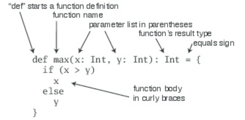

## Chapter 2
# First Steps In Scala

>***The Best Way To Learn Scala Is To Program In It.***

This chapter and the next chapter will enable programmer to develop useful programmes in Scala. 

**Useful Links:**

[Scala Downloads](http://www.scala-lang.org/downloads)

[Scala-IDE](http://scala-ide.org/)

[IntelliJ IDEA](https://www.jetbrains.com/idea/)

[Scastie](https://scastie.scala-lang.org/) (Online Compiler + Interpreter)

**Resources**

Use the [chapter-2.sc](https://github.com/shankarshastri/ProgrammingInScala/blob/master/chapter-2/chapter-2.sc) (Scala Worksheet).

If using Scastie directly use this link for code: [Chapter-2 Scala Worksheet](https://scastie.scala-lang.org/shankarshastri/PLo5I6s0T8yHseSRi1Ljcg)

---

#### STEP 1. LEARN TO USE THE SCALA INTERPRETER
We can start using Scala interpreter by typing the Scala command on the command line.
The behavior with Scala worksheet is bit different, where the expression value is evaluated but resultant variables per expression need to be provided by the programmer.

```scala
$ scala
Welcome to Scala version 2.12.5
Type in expressions to have them evaluated.
Type :help for more information.
scala> 1+2
res0: Int = 3
scala> res0 * 3
res1: Int = 9
scala> println("Hello, world!")
Hello, world!
```
An automatically generated or user-defined name to refer to the computed value (res0, which means result 0). After colon is the datatype of the resultant. After equal is the value of the val. The println function prints the passed string to the standard output, similar to System.out.println in Java.

---
#### STEP 2. DEFINE SOME VARIABLES
Two kinds of variables namely **val** and **var** are the keywords used to create them.

>val => Immutable, Similar to final variables in Java, Cannot be reassigned.
> var => Mutable, Can be reasigned(changed) at any point of time within the scope of the variable.

Defining a variable
```scala
scala> val msg = "Hello, world!"
msg: String = Hello, world!
```
Here msg is a type of **java.lang.String**. Scala's type-inference is very powerful feature, compiler can automatically infer the type based on the value.

Explicitly Specifying The Variable DataType
```scala
scala> val msg2: java.lang.String = "Hello again, world!"
msg2: String = Hello again, world!
scala> val msg3: String = "Hello yet again, world!"
msg3: String = Hello yet again, world!
scala> println(msg)
Hello, world!
scala> msg = "Goodbye cruel world!"
<console>:8: error: reassignment to val
msg = "Goodbye cruel world!"
scala> var greeting = "Hello, world!"
greeting: String = Hello, world!
scala> greeting = "Leave me alone, world!"
greeting: String = Leave me alone, world!
scala> val multiLine =
| "This is the next line."
multiLine: String = This is the next line.
scala> val oops =
|
|
You typed two blank lines. Starting a new command.
scala>
```

---
#### STEP 3. DEFINE SOME FUNCTIONS

```scala
scala> def max(x: Int, y: Int): Int = { if (x > y) x else y }
max: (x: Int, y: Int)Int
scala> max(3, 5)
res0: Int = 5
scala> def greet() = println("Hello, world!")
greet: ()Unit
```

Function definitions start with **def** followed by name of the function. And parameter's inside paranthesis and they are val in nature. Scala requires parameter type to be specified, since their types can't be infered, but return types in scala is infered.
Most of the things in Scala are expressions which returns a value. As shown above if is a expression. In case of recursive functions we may require to specify the return type of the function. We see that in last example above, function greet that takes no parameters and returns no interesting result. Here Unit type is similar to void type in Java.

```scala
scala> :quit
$
```
for quiting the interpreter.

---

#### STEP 4. WRITE SOME SCALA SCRIPTS

Scala code can also be run as a script. Add the below line in any file({fileName}.scala).
```scala
println("Hello, world, from a script!")
```
And then on running it.
```scala
$ scala hello.scala
Hello, world, from a script!
```
Command line arguments are accessible from Scala arrays named args.

---

#### STEP 5. LOOP WITH WHILE; DECIDE WITH IF
Imperative way of writing code in Scala to iterate through index.
```scala
var i = 0
while (i < args.length) {
    println(args(i))
    i += 1
}
```
---

#### STEP 6. ITERATE WITH FOREACH AND FOR
Scala provides concise and functional programming constructs using which programming things will be straight forward.

**Using *foreach* construct**
```scala
args.foreach(arg => println(arg))
args.foreach((arg: String) => println(arg)) //Specifying type explicitly
```

**Using *for* expression**
```scala
for (arg <- args)
println(arg)
```
---

#### CONCLUSION

This chapter basically gave a clear understanding about scala basic usage.

---
